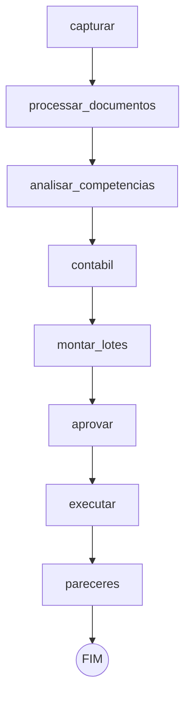
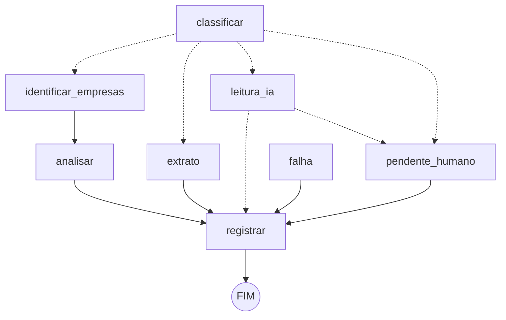

# mo_autonomo — Moraes & Oliveira Contabilidade

Sistema que **recebe** os documentos dos clientes pela caixa fiscal (IMAP, somente leitura),
**entende** cada documento à luz do **perfil fiscal** da empresa na data, **analisa** como
especialista contábil/fiscal/DP com base normativa conferida, **organiza** nas pastas das
Rotinas Automáticas do Domínio, **propõe** lançamentos contábeis, **audita** o que foi
importado no Domínio e gera **parecer técnico** por empresa e competência.

O processamento é um **grafo de estados** (graph engineering): cada etapa é um nó, as
transições são arestas fixas ou condicionais, cada passo é gravado como checkpoint na trilha
SQLite (um ciclo interrompido é retomado do ponto exato) e qualquer erro inesperado vira
pendência com motivo — nunca some.

> **Comece por [`docs/IMPLANTACAO.md`](docs/IMPLANTACAO.md)** (passo a passo no escritório).
> Regras do projeto: [`CLAUDE.md`](CLAUDE.md). Esquema da base normativa:
> [`config/normas/LEIA-ME.md`](config/normas/LEIA-ME.md).

## Grafo do ciclo (roda de hora em hora)



## Subgrafo por documento



| Nó | O que faz |
|---|---|
| capturar | IMAP com `EXAMINE` + `BODY.PEEK` (não marca como lido, não move, não apaga); extrai anexos e ZIP aninhado (com trava contra zip-bomba); guarda o bruto em `_BRUTO_EMAIL` e registra sha256 (dedupe). |
| classificar | Pelo conteúdo: NF-e, NFC-e, CT-e, NFS-e Nacional e ABRASF, eventos, OFX, PDF, imagem. XML com DTD/ENTITY é recusado. |
| identificar_empresas | Cruza participantes com a carteira **por CNPJ** e define a pasta `XML NOTAS\<TIPO>\<Código-Apelido>\MMAAAA`. CT-e só vai para o **tomador** (toma3/toma4). NFC-e, sentido da NF-e e posições da chave dependem do MOC conferido. |
| analisar | Monta o **perfil fiscal** da empresa na data do documento e roda as regras do especialista. |
| extrato | Identifica a empresa dona da conta do OFX (`contas_bancarias.csv`). |
| leitura_ia | PDF: extrai texto e lê com a **cascata de IAs**; saída validada contra o texto (CNPJ/valor inventado = pendência). |
| analisar_competencias | Regras do mês: duplicidade, cancelamentos, buracos na numeração. |
| contabil | OFX → lançamentos propostos usando o **razão do próprio cliente** como de-para. |
| montar_lotes | Um lote por empresa × competência × área (um problema não trava as outras empresas). |
| aprovar | Aprovação por exceção (desligada por padrão) — ver abaixo. |
| executar | Só com `APROVADO_*` íntegro; nunca sobrescreve arquivo. Em simulação grava em `dados/_STAGING`. |
| pareceres | Parecer MD + XLSX por empresa/competência e resumo do ciclo. |

## Ciclo de vida (nada some)

- **Documento**: `ANALISADO` → `OK` só quando o lote dele é gravado; `PENDENTE` volta sozinho
  quando normas/cadastro/exportações mudam; `FILA` (sem IA disponível) volta todo ciclo;
  `ERRO` vira pendência com o motivo. Anexo capturado e não processado volta no ciclo seguinte.
- **Ação** (tabela `acoes` da trilha): `PROPOSTA` → `EXECUTADA` | `FALHOU` | `BLOQUEADA`. Ação não
  é proposta duas vezes; a que falhou (ex.: `D:` fora do ar) é refeita a cada ciclo até
  `execucao.max_tentativas` (padrão 24); conflito de arquivo ou tentativas esgotadas viram
  `BLOQUEADA` e aparecem no resumo para uma pessoa resolver. Lançamento contábil é identificado
  por banco+conta+FITID+data+valor; transação sem FITID vira pendência `SEM_FITID`.
- **Lote**: só documentos limpos. Pendência e achados de um documento retido vão como
  *informativos* e não travam o APROVADO (nem a auto-aprovação) das notas boas. Falha do grupo
  inteiro (ex.: análise do mês) bloqueia o lote sem ações e os documentos voltam no ciclo
  seguinte. Lotes ainda sem aprovação de ciclos anteriores são reapresentados no resumo/painel.
  Reprocesso que não muda nada não gera lote nem parecer repetido.

## Perfil fiscal do cliente

O sistema decide a legislação aplicável pelo perfil **na data do documento**:

| Dado | Fonte primária | Cruzamento |
|---|---|---|
| Regime (Simples/MEI com datas) | Dados Abertos do CNPJ (RFB) | Cadastro do Domínio, CRT dos XML |
| Presumido / Real | Cadastro do Domínio (não é público) | — |
| CNAE, natureza jurídica, situação | Dados Abertos do CNPJ | — |
| UF / município / IE | Cadastro do Domínio | RFB |

Divergência entre fontes = **pendência bloqueante** (o regime fica indefinido e as regras que
dependem dele não rodam). Os códigos da RFB (situação ativa, opção "S") só são usados com a
norma `DICIONARIO_DADOS_ABERTOS_CNPJ` conferida. Normas têm `aplica_se` (regime, UF,
município, CNAE, natureza) e vigência.

## Regras do especialista

Natureza (regra 5): **APONTAMENTO** = todas as normas citadas conferidas; **INDÍCIO** = alguma
não conferida (não vira ação); **CONTROLE** = fato objetivo. Regra com parâmetro legal fica
**INATIVA** enquanto a norma não for CONFERIDA (`python -m mo_autonomo normas cobertura`).

| Regra | O que verifica | Normas / parâmetro |
|---|---|---|
| NFE_SOMA_ITENS | Soma dos itens que compõem o total (indTot) × vProd | MOC_NFE.ind_tot_compoe |
| NFSE_CANCELADA | NFS-e ABRASF com registro de cancelamento | — (CONTROLE) |
| DFE_SEM_PROTOCOLO | XML sem protocolo de autorização | — (CONTROLE) |
| DFE_CSTAT | cStat fora da lista de autorização | MOC_NFE.cstat_autorizado |
| NFE_CRT_REGIME | CRT do emitente × regime do perfil | MOC_NFE.crt_por_regime |
| NFE_CFOP_TPNF | CFOP × tipo da operação | TABELA_CFOP.cfop_digitos_por_tpnf |
| NFE_CFOP_IDDEST | CFOP × destino (interna/interestadual/exterior) | TABELA_CFOP.cfop_digito_por_iddest |
| NFE_DEVOLUCAO_SEM_REF | Devolução sem NFref | MOC_NFE.fin_nfe_devolucao |
| SIMPLES_MONOFASICO | NCM monofásico em saída de empresa do Simples → segregar no PGDAS-D | TABELA_NCM_MONOFASICO + LC 123 + CGSN 140 |
| NFSE_ISS_RETIDO_NACIONAL / _ABRASF | ISS retido a recolher pelo tomador | LC 116 + leiaute (código de retenção) |
| NFSE_RETENCOES_FEDERAIS | CSLL/COFINS/PIS esperada e ausente (tomador); IRRF/INSS não contam | LEI_10833_ART30 (+ código de retenção PIS/COFINS do leiaute nacional) |
| DOC_COMPETENCIA_ROTINA | Competência que a rotina automática não importa | — (CONTROLE) |
| DOC_EMISSAO_FUTURA | Emissão após o processamento | — (CONTROLE) |
| DOC_CNPJ_INVALIDO | DV de CNPJ inválido | — (CONTROLE) |
| COMP_DUPLICIDADE | Mesma chave com conteúdos diferentes (no mês e no histórico) | — (CONTROLE) |
| COMP_CANCELAMENTO | Evento de cancelamento homologado recebido | MOC_NFE.tp_evento_cancelamento + cstat_evento_homologado |
| COMP_SEQUENCIA | Buracos na numeração das notas emitidas | — (CONTROLE) |
| COMP_RECEITA_X_DECLARADA | Faturamento dos XML emitidos (acumulado no mês) × receita declarada em `dados/apuracao/receitas.csv` | — (CONTROLE; NF-e/canceladas dependem de MOC_NFE) |
| DP_INSS_DIVERGENTE | INSS do empregado × tabela progressiva | TABELA_INSS_SEGURADO.faixas |
| DP_IRRF_DIVERGENTE | IRRF × tabela, dependentes e redutor | TABELA_IRRF_MENSAL |
| DP_FGTS_DIVERGENTE | FGTS depositado × remuneração × alíquota | LEI_8036_FGTS.aliquota_deposito |
| DOMINIO_NAO_IMPORTADO / _VALOR_DIVERGENTE / _SEM_DOCUMENTO | Auditoria do Domínio × documentos capturados | — (CONTROLE) |

## Aprovação por exceção (regra 6)

- **Humana**: `python -m mo_autonomo aprovar --lote dados/lotes/lote_X.json --usuario "Nome"` —
  cola o hash e digita exatamente `APROVADO`. Recusa com pendência.
- **Automática** (config `aprovacao_por_excecao.ativa: true`): só se zero pendências, nenhum
  achado bloqueante, nenhum INDÍCIO/APONTAMENTO, ações da lista `acoes_auto_permitidas` e
  valor dentro de `valor_limite`. Registrada como `AUTO_APROVADO` na trilha.
- **Sempre humano**, sem bypass: transmitir declaração (EFD, DCTFWeb, PGDAS, Reinf,
  eSocial), emitir/pagar guia, ato societário, alterar cadastro.

## IA gratuita em cascata (regra 11)

`ia.provedores` no config, em ordem. Ollama local recebe o texto bruto; APIs na nuvem
(Gemini, Groq, OpenRouter `:free`, Mistral, Cerebras…) só recebem texto **mascarado** — a
cascata recusa o envio se ainda houver CPF/CNPJ/e-mail/chave. HTTP 429/402 ou mensagem de
cota pausa aquele provedor (`Retry-After` ou `espera_padrao_s`) e passa para o próximo; sem
nenhum disponível o documento vai para a fila (`FILA_IA`) e volta no próximo ciclo. A IA
nunca decide regra fiscal.

## Monitor de normas e calendário

- **Monitor**: baixa a `fonte_url` oficial, normaliza o texto e compara com `hash_texto`.
  Norma CONFERIDA cujo texto mudou vira `ALTERADA_RECONFERIR`: as regras que dependem dela
  ficam inativas até a pessoa reconferir.
- **Calendário**: obrigações só de normas CONFERIDAS com parâmetro `obrigacoes`
  (`codigo`, `dia`, `meses_apos_competencia`, `regimes`), filtradas pelo perfil de cada
  cliente. Sábado, domingo ou feriado (`calendario.feriados`) → antecipa para o dia útil
  anterior (regra do escritório). Alertas 3 dias antes e no dia entram no resumo do ciclo.
- **Fila da IA**: documento que ficou sem IA disponível (cota) volta sozinho no próximo ciclo.

## Instalação (Windows do escritório)

```powershell
cd "C:\Users\fabio moraes\mo_autonomo"
powershell -ExecutionPolicy Bypass -File scripts\instalar_windows.ps1
```

Cria `.venv`, roda os testes, copia `config.exemplo.yaml` → `config.yaml` (modo
**simulação**) e registra as tarefas no Agendador **desativadas**.

## Comandos

```text
python -m mo_autonomo ciclo            --config config/config.yaml
python -m mo_autonomo retomar --run ID --config config/config.yaml
python -m mo_autonomo aprovar --lote ARQ --usuario NOME
python -m mo_autonomo executar --aprovado dados/lotes/APROVADO_X.json
python -m mo_autonomo perfil atualizar   # lê dados/rfb (zips oficiais) e gera relatório de perfis
python -m mo_autonomo perfil relatorio
python -m mo_autonomo imap testar
python -m mo_autonomo auditar-dominio --relatorio rel.csv --cnpj 00000000000000 --competencia 2026-10
python -m mo_autonomo dp conferir --folha folha.csv --cnpj 00000000000000
python -m mo_autonomo normas cobertura   # quais regras estão ativas/inativas e por quê
python -m mo_autonomo normas monitorar   # texto oficial mudou? norma volta a exigir conferência
python -m mo_autonomo normas conferir --id MOC_NFE   # ficha p/ a pessoa conferir (não marca CONFERIDO)
python -m mo_autonomo calendario --competencia 2026-10   # vencimentos por cliente + alertas
python -m mo_autonomo grafo desenhar
python -m pytest -q
```

## O que depende do escritório (sem isso o sistema fica em pendência, de propósito)

1. **Conferir as normas** em `config/normas/` (todas PENDENTES hoje). Prioridade, pelo que
   destrava: `MOC_NFE` (sentido da NF-e, NFC-e, indTot, CRT, cancelamento) → `MOC_CTE` (tomador) → `TABELA_CFOP` →
   `DICIONARIO_DADOS_ABERTOS_CNPJ` → leiautes de NFS-e → `LEI_10833_ART30` →
   `TABELA_NCM_MONOFASICO` → tabelas de INSS/IRRF.
2. **`config/empresas.csv`** a partir da exportação do cadastro do Domínio (código, apelido, CNPJ, regime, UF, município IBGE).
3. **Servidor/porta IMAP** do Email em Nuvem e senha no keyring.
4. **Exportações do Domínio** por empresa em `dados/dominio/<código>/`: `plano_contas.csv`, `razao.csv`.
5. **Leiaute oficial de importação** do Domínio (lançamentos/folha) — o exportador só é escrito com ele.
6. **Colunas do relatório** do Domínio para a auditoria (`dominio.relatorio_colunas`).
7. Zips dos **Dados Abertos do CNPJ** em `dados/rfb/`.

## Limites honestos

- O Domínio não tem API: a entrada automática é via Rotinas Automáticas (XML) e leiautes de
  importação. Robô de tela no GraphOn não foi implementado (frágil).
- "100% autônomo" aqui significa: tudo que é reversível roda sozinho; o que gera obrigação
  para o cliente (transmitir, pagar, alterar contrato) sempre para numa pessoa.
